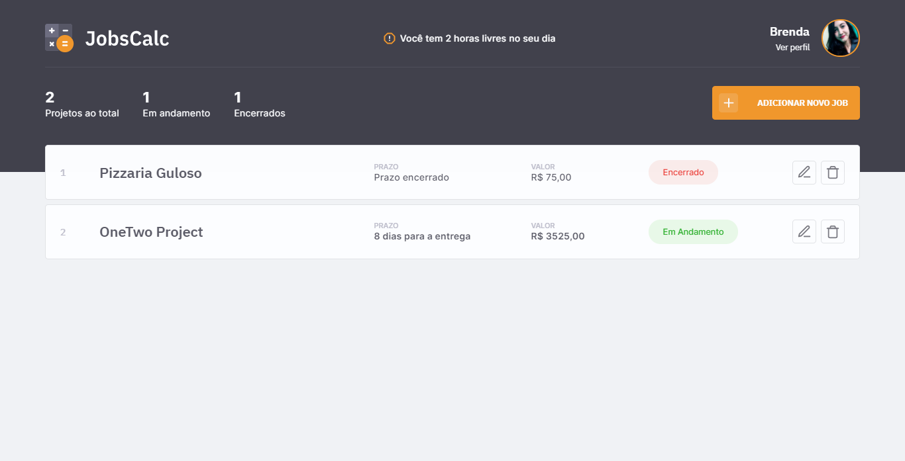
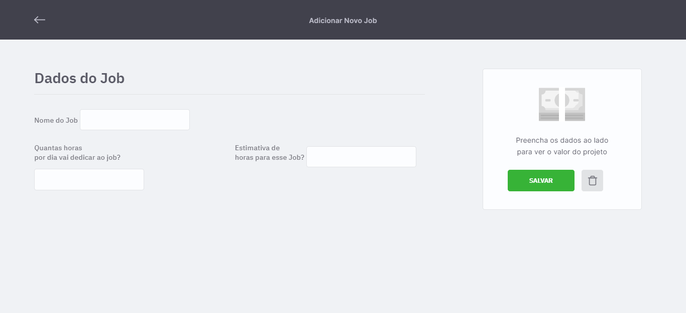
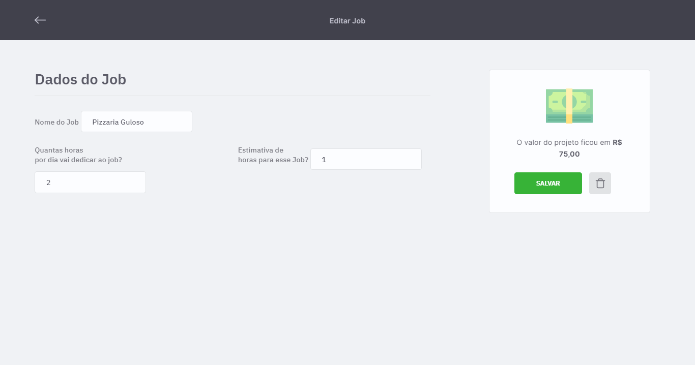
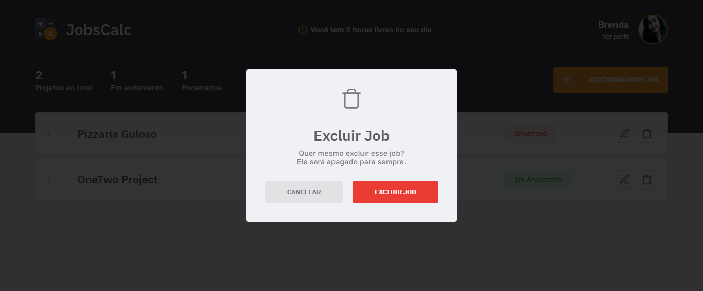
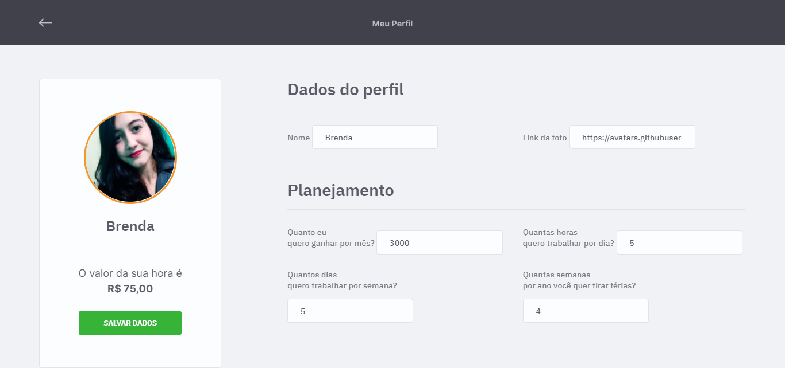

<h1 align="center">
  
</h1>

  <a href="#-tecnologias">Tecnologias</a>&nbsp;&nbsp;&nbsp;|&nbsp;&nbsp;&nbsp;
  <a href="#-projeto">Projeto</a>&nbsp;&nbsp;&nbsp;|&nbsp;&nbsp;&nbsp;
  <a href="#-layout">Layout</a>&nbsp;&nbsp;&nbsp;|&nbsp;&nbsp;&nbsp;
  <a href="#memo-licença">Licença</a>

 

  

 

## 🚀 Tecnologias

Esse projeto foi desenvolvido com as seguintes tecnologias:

- HTML
- CSS
- JavaScript
- NodeJS
- EJS
- Express
- SQLite

## 💻 Projeto

O JobsCalc é uma aplicação de estimativa de cálculo para projetos freelancer. É possível calcular o valor da hora de trabalho do Freelancer, de acordo com as informações preenchidas, dessa forma, ao cadastrar um projeto, o sistema estipula o custo do job em horas trabalhadas. Além de criar, você consegue editar e excluir os projetos.

## 🔖 Layout

 

  

  

  

  

  

## :memo: Licença

Esse projeto está sob a licença MIT. Veja o arquivo [LICENSE](.github/LICENSE.md) para mais detalhes.

---

Feito por Brenda Orlandi, ensinado pela Rocketseat - Maratona Discover.
